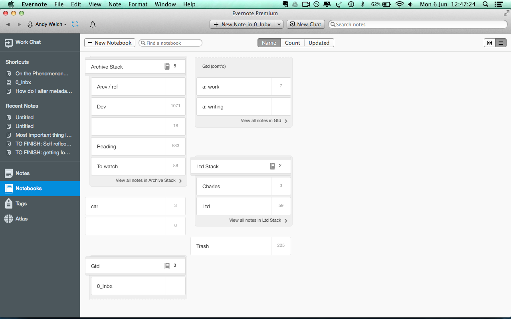
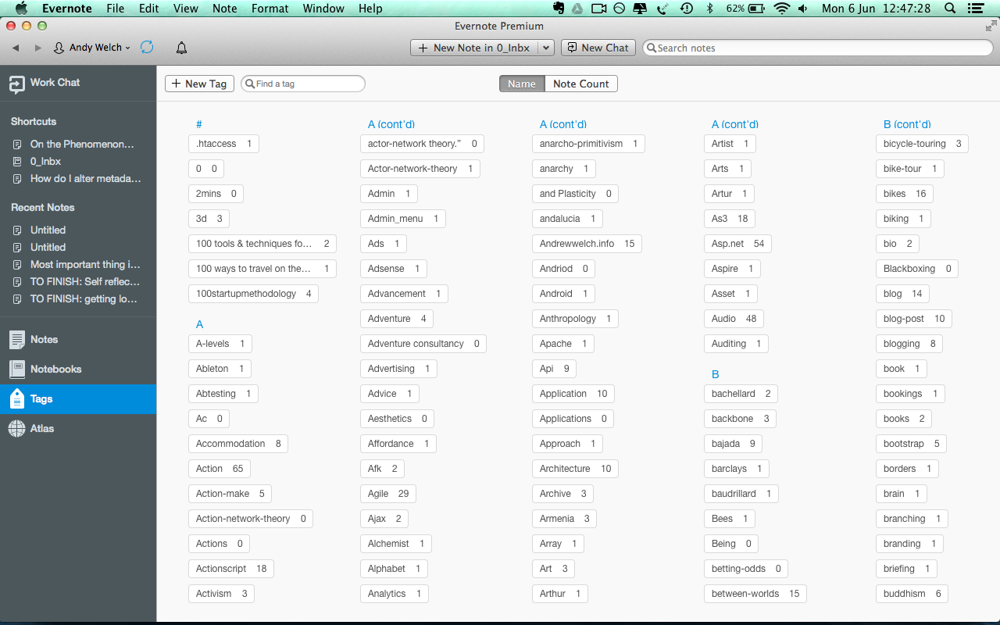
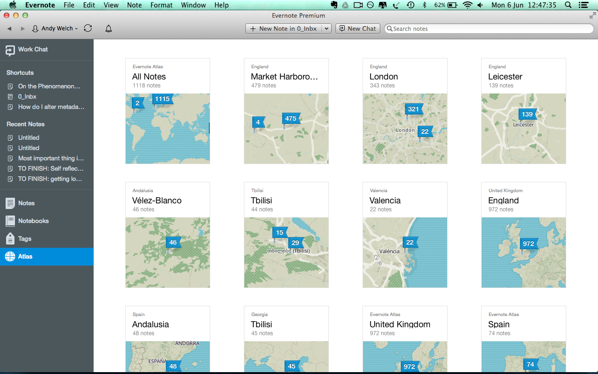
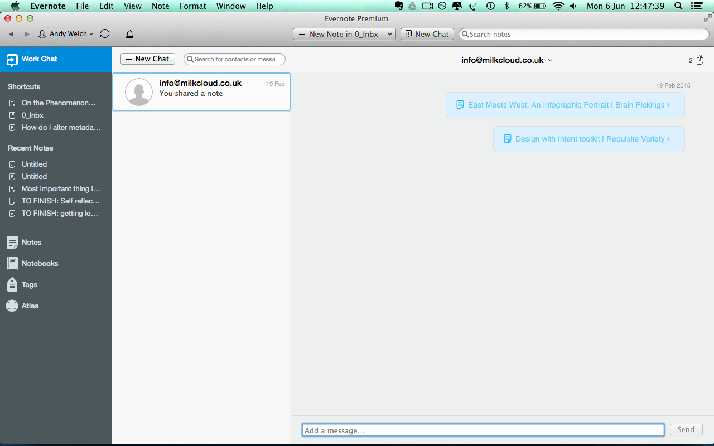

#Evernote Evolved: Maximise your Productivity with this Simple Method
by Andrew Welch

##Preface

Evernote is a useful piece of software. It comes at a time where there is much information out there and it needs to be curated. Curation doesn't happen just in the sense of a traditional 'designated' curator, but personally at the individual level. We are all becoming curators because the internet presents us with so much content, that you either participate or ignore it.

Before Evernote, I tried to do this with my computer's folder structure. Not knocking operating systems or anything but they have thus far not been well suited to tagging, categorising and organising information, files and media from a whole variety of sources, and then allowing the user to quickly access and drill down into that information. The search on (many common) operating systems tends to be slower and work less well than the one in Evernote!

For me that is the beauty of Evernote. At the point of capture you can throw everything in and then you can create your own process that can be refined over time that helps you to:

- Research and capture what you need from the net
- Archive what you want to keep but not use right now
- Refine and evolve ideas
- Get to the information you need faster

However, like anything you get out what you put in and Evernote is no different. That is why I am sharing with you in this ebook of my Evernote process. 

I intend to create further new revisions as my process evolves and as I find new ways to get value from Evernote. I've recently started hosting my ebooks in a version control system like Git because it allows you to see the changes easily.

##Introduction

I began using Evernote when it first came out in 2007. Early versions of the software had bugs and needed improvement, but the gist was there. 

People needed a way to 'capture everything'. The everyday technology possibly wasn't quite up to scratch at first to fully realise the potential, but as smartphones have got better, faster and the Evernote app has improved, the possibilities with the software have grown. 

A piece of software like Evernote is a revolution is how we relate to information. It supposes that you are going to be capturing information on the fly. 

Evernote is going to store that information for you in an array of different formats. But when you come to open the program, other than the search, you are going to need to do some work to extract the value from the content you have collected. 

You are going to have to come up with a system. 
The system will relate to what you are using Evernote for, whether writing a thesis, collecting information about a product, developing a new product, writing a book, or using it as a task manager. 

##Chapter 1: The software

Evernote is available in a paid version or a more restricted free version. Use of the online service is free up to a certain monthly usage limit, with additional monthly use reserved for Plus subscribers, and unlimited monthly use for Premium customers.

The paid version is recommended because you can capture everything. You won't come up against a limit. 

###Interface

The interface is fairly intuitive

- A button in the centre of the top bar to create new notes
- A search bar for searching (and additional options pop up to search only in tags and other parameters)

###Notebook view 

- A button to create a new notebook
- A search box to search notebooks
- Organise your notes into 'stacks' (notebooks with notebooks inside them  become stacks)

###Tag view

- View all the tags
- Search through tags
- Order by alphabetical or count

###Note view

- View and edit the contents of the note
- A wysiwyg editor view for content

###Map view

- View notes by location
- Notes contain geolocation information

###Chat view

- Chat with others on Evernote (I don't use this that often)

##Chapter 2: Approaches

I've been through quite a journey with Evernote to figure out how to use this powerful, but deceptively simple and flexible software. Its not been an easy ride by any means, but I definitely feel as if I have made progress. 

Like anything it involves creating constraints that have helped me to be more productive, organised and creative. 

My experience with Evernote has lead me to understand the strengths and weaknesses of trying to organise yourself and your work purely through a digital solution. 

Evernote has its place but for me it fits now into an ecosystem that involves other software and old school tools like whiteboards, markers and sticky notes.

Some of my initial questions when I become more serious about my Evernote process.  First I tried to define what Evernote is and came up with:

> Evernote is a a system for archiving and prioritizing.

I had unclear requirements for my use of Evernote which was causing a real mess. I love trying to find order in chaos however, and my Evernote become an object of focus and obsession. 

It felt like Evernote and my mind were connected and I needed to tidy Evernote and process is to make progress in my own thoughts. 

###Case Study:  Researching topics

I was  researching creating a new product, market testing and connecting with the audience.

- connecting / community
- making / logistics
- funding / getting paid

 'CC' or 'connecting community' with was all about strategies for hustling, PR and marketing.

I resolved to this method by asking myself a series of questions:

- What is the point of this notebook? 
- What will be the outcome from this research? 

Then I answered the questions, so I wouldn't forget the reason for having that 'container' of information. There is no point collecting information for the sake of it. There is too much out there! It sounds absurd. This helped me to set off on a path of reducing and simplifying down to what would be the most impactful and useful.

>The point of the CC notebooks is to research the process of making people hear about my products and building my community.

After using this method for about a year I ended up with a fair few notebooks but each had only a few notes in. I had split the 'topic of interest' down into sub-categories. For example, under 'community' was 'social media'.

This might work better for you if you are using Evernote to focus deeply on one topic. However, this method does reflect traditional paper filing. I have since settled on a (in my opinion) better method not using many nested notebooks.

###Case Study 2: Notebook per Project

I created a notebook for each project I had and a notebook for categories of activity. 

For example, I had a notebook for a tour guide offering I was working on. 

I put anything related to that project inside the notebook. 

I also planned to move or copy relevant information from the research notebook into the folders for the projects.

However, this did lead the question of duplicate content. As something from my research might apply to multiple projects. 

###The invisible habit of paper filing vs a new world of tags

> If you find yourself asking the question, "Where do I put this*note?" or you feel intimidated by the complexity of nested notebooks, you might only want to use a maximum of four or five notebooks. Use tags and Saved Searches as a way of making very focused collections of notes available when needed.

In a paper filing system you need to get ever more fine grained in order to help to search through for specific topics. 

However, Evernote has other features that mean this route is not necessary the most efficient. For example using a taxonomy of tags to organise. 

>Tags let you put one thing in many places, which you obviously can't do with a piece of paper. 

One example of where I have gone done this route, is my archive folder. If I am going to archive something I tag it first with numerous tags. A blog post tagged with writing, posted, technology and then moved to the archive/reference notebook.

You can then search by tags and the same piece of content may appear for multiple different searches. E.g. it has multiple relevance. This saves time and energy because the same content isn't in danger of getting repeated. This follows the programming concept of DRY (don't repeat yourself).

All notes benefit from having tags applied to them- particularly if the subject of the note is particularly specific e.g.

###Case Study 3: Technical notes

I am a web developer and I use Evernote to store code snippets. There are so many different technologies though that it soon made sense not to have a notebook for each and use tags instead. 

For example you come across a piece of code on the web and you use Evernote web clipper to capture it. It is written in Javascript. 

Instead of making a Javascript notebook. we tag it Javascript and anything else that is relevant then put it in the (in my case) dev folder. 

###Case Study 4: Bucket folders

My 'dev' folder is what I call a bucket folder. It is a high level category into which I throw a lot of content that is loosely related. In this case it could be described as being in the same industrial domain. 

In the past I also had a folder for 
- Making
- Ideas
- Research

At the time I saw Ideas / Research as ‘The quest’ part of me discovering information. The idea was to pick things out that were useful. 

Now I've moved away from having all of these because it created a dilemma of whether I should put a note in this bucket or it should be in its own project. Some things I collected were interesting, perhaps may relate to a project in the future. However, I found the best way  was just to simplify.

##Chapter 3: Applying GTD to Evernote

The following is my attempt at integrating GTD into my Evernote process in order to make the content I collected more actionable. I've pared it back since, but I still use elements from it.

###Capture
I've got an notebook called 'inbox' set to be the default place that content lands. This has replaced my previous research folder too.

####How do you know what is the valuable enough to capture?

- Skim read things on the spot if you can
- Only save a full article as opposed to a bookmark if its really value and relevant.
- Ask yourself often am I likely to use this piece of information? 
- Does it help with my goals and objectives?

>Be suspicious of the mindset of collecting for future organising or reference as this is only going to tie up your time when you might need your time for something else.

###Process
Process the capture folder
Do items that will take less than 2 mins

- Delegate it
- Give it a date
- Put it into a 'todo' list (outside of Evernote, although  you can make a tick list - more on this later)
- Archive it

###Status

Give it a status (you can tag it or put a note in the title):
- Action
- Waiting
- Someday

###Archive

When I had a notebook for each project I also had an archive notebook for that project. I've since moved away from this as I've increasingly learnt the power of tagging. However, it might be useful if you want to ringfence things further.

###Project notebooks

My interpretation of my project notebooks through the lens of GTD lead to the following thought process:

- Project notebook contains 'tasks'
- Actionable tasks have a reminder set on them so they appear at the top and tagged with their status e.g. action
- Once actioned, tasks get moved into the archive folder and are tagged with their status eg. reference
- When this work is done I tag every note in the project-specific notebook with the title of the project, dump all the notes into the Archives, and delete the empty project folder.

###GTD time elements

I don't use all the following categories, but I do still have my big rocks for the week, and I do have an archived note with my 'horizons of focus' which I revisit every year or so.

- 3 MITs per day
- 3 big rocks per week
- 3 hills per month
- 3 mountains per year

###Horizons
- Goals/objectives 6-18 months
- Visions/objectives 3-5 years
- Life / works’s purpose

##Chapter 4: Do I put it in Evernote or in the OS filesystem?

All superficially sized files and information is kept in Evernote. Any larger files are kept in folders. Legacy information is kept for reference, and archived once products have been created.

###Data structure:-

On the filesystem, I've got a folder structure like this for products / projects. 

Making/Products
->Product Name
->stages of completion
-->Research stage
--->Research structure
---->In the world / epistemic
---->Images
---->Historical context
-->Prototype
---->Drawing
---->Model Making
---->Testing
-->Manufacturer
---->Process of development images.
---->Finished Products

I am a designer and a web developer so you may want to adapt the folder structure or throw it out completely. The main point is to have a way to capture your bigger files outside of Evernote.

##Chapter 5: My current process

My advice is to limit your notebooks as much as possible. 

My current notebook set up is:

###GTD stack
- inbox
- action: work
- action: writing

###Archive stack
- Archive/ reference
- Dev (programming related)
- Reference (used very often)
- To read
- To watch

###Car stack (anything to do with my car)

###LTD
- Anything to do with my LTD

###Trash

> As you can see I have no project folders or category folders. I threw them out entirely choosing instead to use tags.

##Chapter 6: Set something up, use it and refine it.

I wrote a process document about my experiences:

###Date: 4/8/14

It is becoming overwhelming because I can only focus on one thing at a time, therefore it might be better to have only one project in the current projects stack and everything else be on the back burner or perhaps one project now and one project looking to the future somehow. Lets test only having max 2 projects in focus.

###Date:  11/8/14 

Its helpful to only have one focus project in evernote and to spend some time doing stuff there.

"If you want to get something done, decide when and where you’re going to do it. Otherwise, take it off your list"

Its clear that some of the stuff requires a mind map. I was doing some research about project management and a common first step is brainstorming, mind mapping or agile would be scoping. So in Evernote some notes are decidedly brainstormy in style and therefore this content needs to be in a different format otherwise it ends up looking terribly confusing written out long hand and with bullet points in Evernote.

###Date: 19/8/14

At some point the use of Evernote is becoming a shuffling around of things. If I don’t engage with them then it is useless. In terms of GTD my Evernote is now definitely a ‘map’ for progress. However, I almost feel like I now need to leave all projects alone for a while and adhoc it - perhaps this is a product of a change in my life rather than the system. 

###Date:  28/1/15

Having implemented the GTD stack, the need for the project archives is diminishing, because the project archives used to represent stuff I had processed for that project. However, I am experiencing that the GTD stack is much more effective way of processing all projects. Its getting more urgent that I’m not going to ever need to go back into individual archives of projects for anything. If anything is referential, then its goes into the reference folder, else it is something that is ‘done’, a task that had to be done that has no or minimal reference value, hence it can go into a catch all ‘completed’ folder.

I’ve gone into the project folders and I’m tagging all the notes with the name of that project. So that I can then move those notes into my GTD actioning stack,  process them and then delegate them into the ‘completed’ notebook and yet they will still have a link back to their project, so the project maintains its integrity and doesn’t break down into a swarm of ideas without coherent form. 

Projects still need their individual note books I think because they represent coherent areas of focus and I’ll sometimes create something in the inbox, that I'm not going to handle right now, and it needs somewhere to live with other things that relate to it, like a long document and some related notes or an article.

###Date:  19/2/15

Continuing with success with the GTD stack, I've now removed many of the project folders and am processing the notes through the GTD stack. Quite naturally I began to create ‘action’ folders that the intention is will ‘chunk’ my time into similar kinds of tasks to avoid having too many difficult kinds of activities in daily life and to be able to gain momentum on projects rather than losing momentum by switching too often.

###Date: 30/10/15

The app Swipes offers the ability to create a note, tag it with swipes and then anything in a checkbox list appears in the associated tasks list in the app
this is what I’m now going to try. I’m hoping this is going to allow me to get a better handle over project tasks that need doing now, which seems to have gone out the window. which is why I shifted to using my mind instead of evernote as much.
I also tag anything with a project name and then stick it in the archive

###Date: 10/11/15

You probably want tasks that have a clear way of knowing whether they have been completed or not. In other words, no vague stuff like be more focused at school, because there's no clear way to know when it is completed.

From my experience, the shorter the tasks are, the better it is for motivation because each time you can cross something out as done you get a little reward from your brain, which helps you focus and keep motivated. So I think it's always better to, say, state 5 steps needed in order to complete a task as separate items that you can complete individually.

###Date: 15/1/15
In the notes with todo lists, only doable tasks should have a checkbox, otherwise have it as just text in a list (i’m currently experimenting with a  highlight if it is more important or I want to flag it to remember).

###Date: 1/31/16
Some of the tasks split into Epics / Stories.

###Date: 2/2/16
Removing a: finance/getting paid etc, folders because its clear they don’t work(!!!). Moving bookmarks into bookmarks manager. Consolidating research into Marxico docs to get an overview e.g. all the a:work docs. Seems to be useful in the sense of being able to assess the research I’ve done faster for insight and a sense of perspective.

###Date: 7/4/16
All short ‘tasks’ now moved into Swipes app - available for iPhone and mac.
I was having a note for tasks  split into headings like work, finance etc, then using Stephen Covey’s Importance / Urgency matrix but I just found that a text list just lacks format that gives enough satisfaction to tick off and also means that it gets out of hand too quick. There is a temptation to copy non-task like content into it which muddies it’s effectiveness. Not urgent / not important tasks aren’t worth it. Neither not important, but urgent. So they are more like a distraction list. (Urgent, important), (not urgent, important) could be used as tags… but it would be nice to have a ‘space’ to drag tasks into designated a category. A google glass type piece of kit that reminded oneself of things you need to do would also be good, doesn’t have to be complicated, just a reminder mechanism. One hell of  a lot of wisdom is needed to get this right though.

###Date: 21/4/16
I’ve got the software Omniplan in an attempt to get an element of time based work into it. I’ve also noticed that when I list todos in Swipes, they aren’t all doable in the moment and can be split into different categories. Swipes has  a great desktop app with a icon in the menu bar in finder that just allows you to write something in it which goes into swipes, a nice little bucket to throw things into. Thats how I have been using it and subsequently I had to go through 100 ideas the next day and split into categories of things like - routine, overall projects, materials to buy, research, etc etc. I’m also planning on buying another big whiteboard for drawing out time based plans.

##Chapter 7: Additional Software

- Marxico - markdown editor that syncs with Evernote
- Swipes - todo list app that syncs with Evernote

##Conclusion

Evernote is a very useful tool. What I've shared is my own process. Much of it boils down to trial and error and making it suit you. However, fundamentally the possibilities for information architecture have completely changed with digitisation and my journey with Evernote reflects a process of discovery that through playing with a tool that offers the most basic of organisational tools such as categorising, folders, and tagging, but the outcome is a very powerful and useful piece of software, that will never forget what you put in it. 

##Contact

http://www.andrewwelch.info
Twitter: andrewwelch5